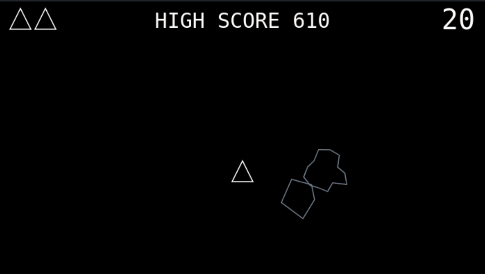

# Asteroids Game

Asteroids Game (1979), was a game maded by Atari. The objective of the game is to destroy asteroids without being hit by their fragments.

## Technology

This game was made using only HTML Canvas, CSS and JavaScript vanilla.

## How to play

To play this game, you just need to clone this repository and open the index.html file in a browser.

- Arrow Left - Rotate the spaceship to the left
- Arrow Right - Rotate the spaceship to the right
- Arrow Up - Thrust the spaceship
- Space bar - Shoot the laser

## Inspiration

This game was made based on this [tutorial](https://www.youtube.com/watch?v=H9CSWMxJx84&ab_channel=freeCodeCamp.org), thx to [FreeCodeCamp](https://github.com/freeCodeCamp)

## ENJOY THE RIDE :smile:

Made with :heart: by [CaueFurui](https://www.github.com/CaueFurui)